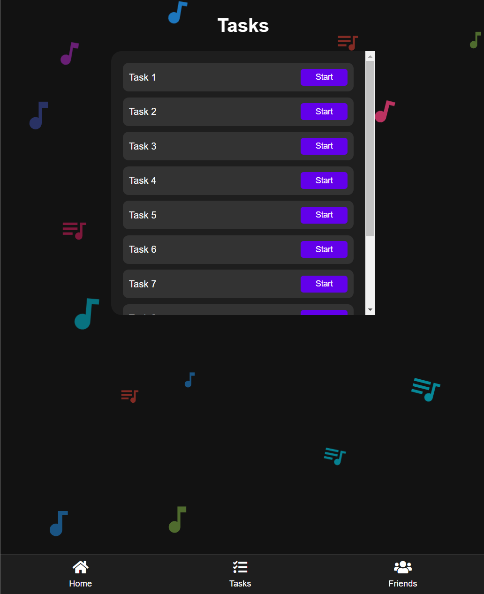

# Piano Challenge Game

This project features **Piano Challenge**, a fun and fast-paced piano game experience. The goal is to tap on falling notes within a limited time to score points. Each note color has a different score and effect. Detailed information is provided below.

## Game Interface

### 1. Home Page:
- Displays the username.
- Shows the game score (with a note icon) in the top left corner.
- Displays game tokens (with a token icon) in the top right corner.
- Click the "Play" button to start the game.
- Includes background animations with music-themed visual elements.

### 2. Tasks Page:
- Displays a list of tasks. You can start a task by clicking the "Start" button next to each task.

### 3. Friends Page:
- View your friends' scores and send them a referral link.
- Your friends' collected points are shown with a note icon.

### 4. Game Screen:
- The game screen contains 4 columns where notes fall from the top to the bottom.
- Each note requires the player to click at the right time.
- Clicking green notes adds time, while blue notes grant extra points.
- Red notes decrease the score and should be avoided.

## Game Mechanics

- **Notes**: There are 4 different note colors in the game:
  - **Black Notes**: Basic notes, clicking them gives +1 point.
  - **Red Notes**: Penalty notes, clicking them deducts 10 points.
  - **Green Notes**: Time-adding notes, clicking them adds 2 extra seconds.
  - **Blue Notes**: Special notes, clicking them gives +100 points.

- **Time**: The game lasts for 30 seconds. When the time runs out, the game ends, and your score is displayed.
- **Scoring**: Your score is based on the notes you click. Black and blue notes increase your score, while red notes decrease it. Green notes extend the game time.

---

Enjoy the game! 🎹
