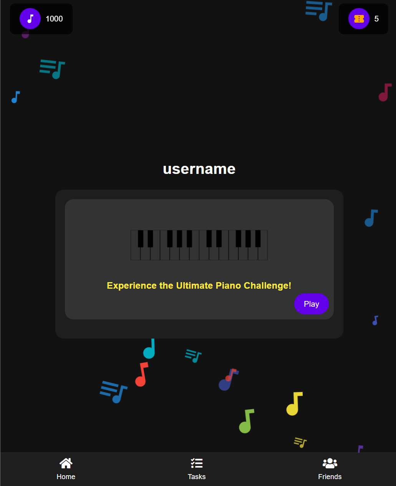
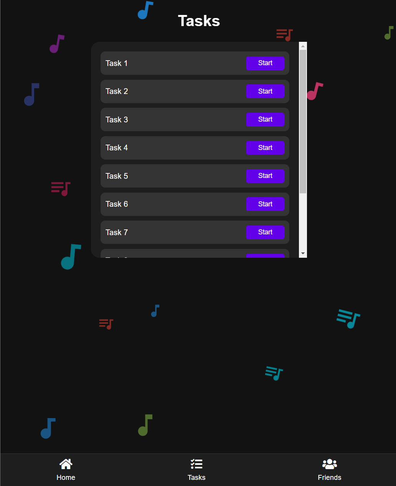
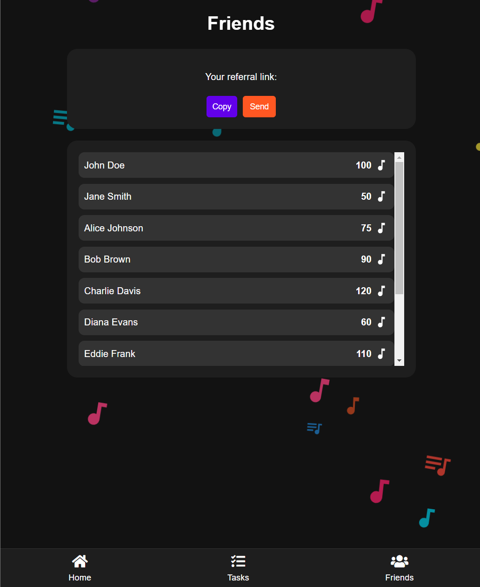
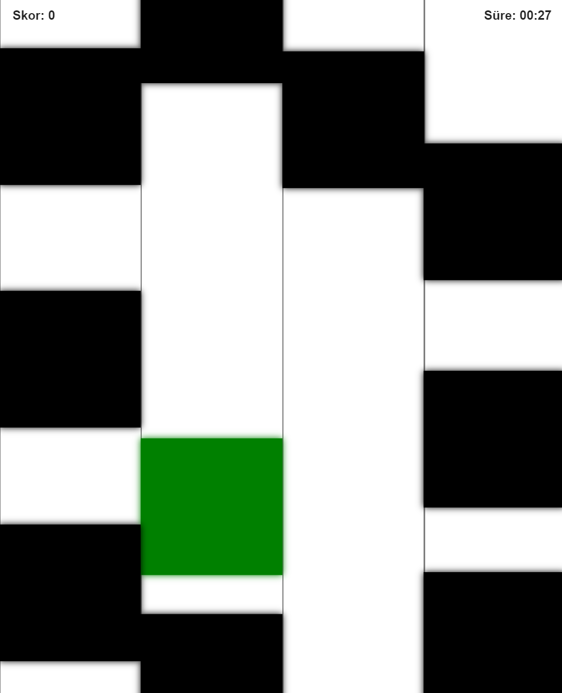

# Piano Challenge Oyunu

Bu projede, kullanıcılara eğlenceli ve hızlı tempolu bir piyano deneyimi sunan **Piano Challenge** oyununu bulacaksınız. Oyun, belirli bir süre boyunca ekranda düşen notalara tıklayarak puan toplamanızı amaçlar. Farklı renkteki notaların her biri farklı puan ve özellikler taşır. Detaylar aşağıda açıklanmıştır.

## Oyun Arayüzü

### 1. Ana Sayfa:
- Kullanıcı adınızı görüntüler.
- Sol üst köşede oyun puanınızı (nota simgesi ile) gösterir.
- Sağ üst köşede oyun jetonlarınızı (jeton simgesi ile) gösterir.
- "Play" butonuna tıklayarak oyunu başlatabilirsiniz.
- Fon müziği temalı arka plan animasyonları ile görsel olarak zenginleştirilmiştir.

### 2. Görevler Sayfası:
- Farklı görevlerin sıralandığı bir sayfa bulunmaktadır. Her görev için "Start" butonuna tıklayarak göreve başlayabilirsiniz.

### 3. Arkadaşlar Sayfası:
- Arkadaşlarınızın puan durumlarını görebilir ve arkadaşlarınıza referans linki gönderebilirsiniz.
- Arkadaşlarınızın topladığı puanlar ekranda nota simgesi ile gösterilir.

### 4. Oyun Ekranı:
- Oyun başladığında ekranda 4 sütun bulunur ve notalar yukarıdan aşağıya düşer.
- Her bir nota, kullanıcıdan doğru zamanda tıklama bekler.
- Kullanıcı, yeşil notalara tıklayarak süre kazanabilir, mavi notalar ise ekstra puan kazandırır.
- Kırmızı notalar ise puan kaybettirir ve bunlardan kaçınılmalıdır.

## Oyun Mekanikleri

- **Notalar**: Oyun içerisinde 4 farklı renk nota bulunmaktadır:
  - **Siyah Notalar**: Temel notalar, tıklanmasıyla +1 puan kazandırır.
  - **Kırmızı Notalar**: Ceza notaları, tıklanmasıyla -10 puan kaybettirir.
  - **Yeşil Notalar**: Zaman kazandıran notalar, tıklanmasıyla ekstra 2 saniye süre ekler.
  - **Mavi Notalar**: Özel notalar, tıklanmasıyla +100 puan kazandırır.

- **Süre**: Oyun 30 saniye boyunca sürer. Süre sona erdiğinde oyun biter ve skorunuz gösterilir.
- **Puanlama**: Skorunuz tıkladığınız notalara göre hesaplanır. Siyah ve mavi notalar skorunuzu artırırken, kırmızı notalar puan kaybettirir. Yeşil notalar süreyi uzatır.

---

İyi eğlenceler! 🎹
